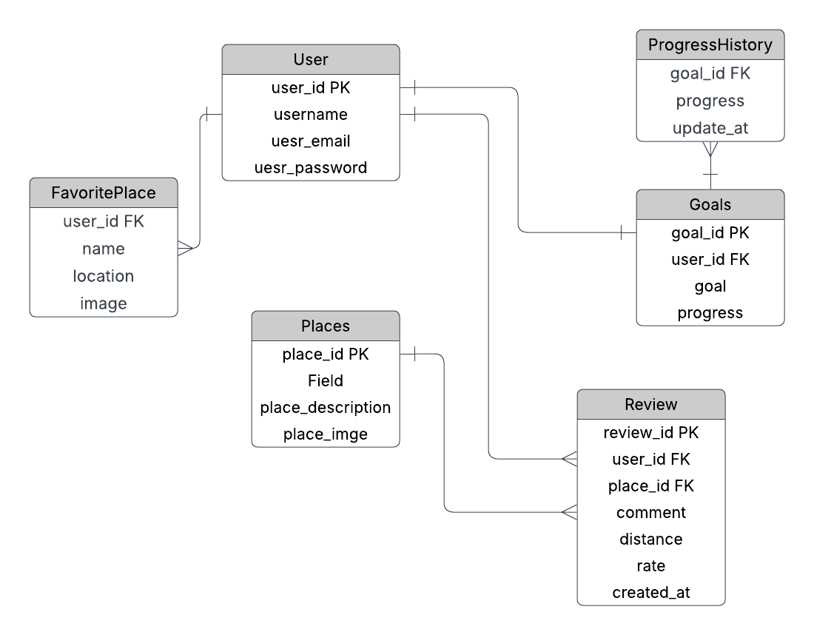

# GO WALK – Discover the Best Walkways & Track Your Progress
##  Project Brief

GO WALK is a full-stack web application designed to help users discover, review, and add their favorite walking places . 
The platform allows users to explore detailed information about walkways, including location, photos, descriptions, and user reviews also users can set their daily step goals and track their progress over time.
## Description
The GO WALK backend is a Django Rest Framework (DRF) API that powers the GO WALK web application
It provides secure and structured endpoints to manage:
- User authentication and registration
- Goal and Progress 
- Wallway Places 
- Review And Comments --> supports full (CRUD) for The Comment owner
- Favorite places --> supports full (CRUD)

### Technologies used
 1. Django
 2.  Rest Framework
 3. PostgreSQL

 ### Frontend Repository
https://git.generalassemb.ly/aseelma12/frontend

## Installation Instructions

To run the project, you need to clone both the backend and frontend repositories. Below are the steps for setting up the backend:

1. Clone the repo:
-  `git clone https://git.generalassemb.ly/aseelma12/backend.git`

2.  To the project directory
- `cd backend`

3. Install dependencies
- `pipenv install django`

4. Activate Virtual Environment
- `pipenv shell`

5. Run the Server
- `python manage.py runserver`

## Routing Table
| **name** | **url** |  **Method** | **Description**                 |
| ----------- |---------|------------|---------------------------------|
| Signup | `signup/` | POST       | Register a new user             |
| Login |`token/` | POST       | Login to get access tokens      |
| Refresh token |  `token/refresh/` |POST       | Refresh the token               |
| Goal |  `goal/` | GET/POST/PATCH | Manage user goals         |
| Progress history |  `goal/history/` | GET        | Get history of progress         |
| Places|  `places/` | GET        | List all places                 |
| Places detail|  `places/<int:pk>/` | GET        | Get details of a place          |
| Comments | `places/<int:place_id>/comments/` |GET/POST   | List or add comments            |
| Comment detail | `places/<int:place_id>/comments/<int:pk>/` | PATCH/DELETE | Edit or delete a comment     |
| Favorite places | `favorite-place/ ` |  GET/POST   | List or add favorite places     |
| Favorite places detail| `favorite-place/<int:pk>/` | PATCH/DELETE | Edit or remove a favorite    |
 

## ERD diagram
### ERD Before Starting Development

The diagram below represents the initial Entity-Relationship Diagram (ERD) that was designed before starting the actual development.

### Final ERD (After Completing Development)

The diagram below shows the final version of the Entity-Relationship Diagram (ERD) after completing the development. 

## IceBox Features
- Reward Model: Automate badge and point allocation when users achieve specific milestones.
- Favorites & Bookmarks Enhancements:
Add advanced features for managing favorite places, such as categorizing or tagging them into different lists.

